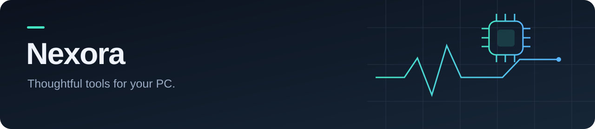
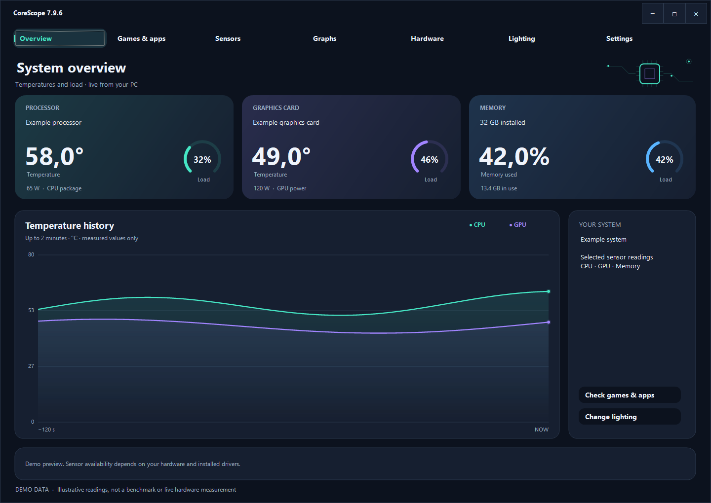
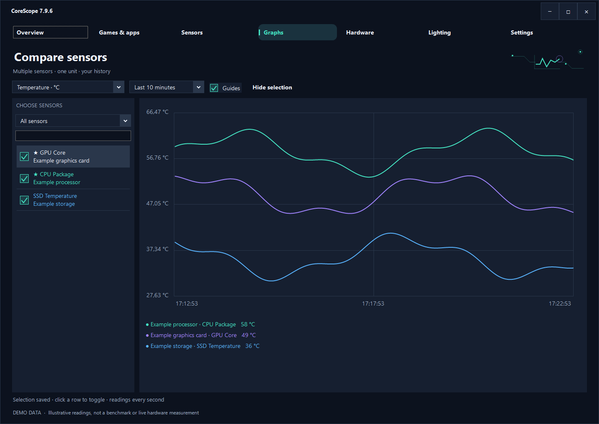
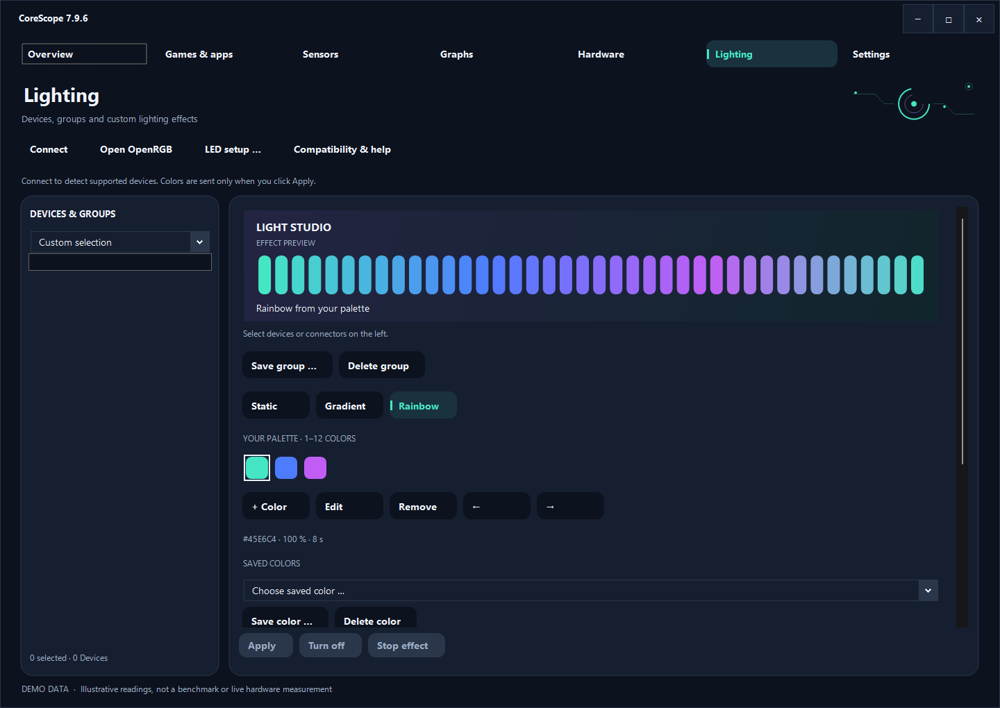

  

I’m building **CoreScope**, a Windows app for understanding your hardware and making your setup your own.

My focus: readable interfaces, useful diagnostics, and customization that stays out of your way.

### CoreScope

**Understand your hardware. Follow its story. Make it yours.**

*Actual CoreScope 7.9.6 interface rendered with synthetic demo readings. These are not live measurements or benchmarks.*

| Monitor | Explore | Personalize |
| :--- | :--- | :--- |
| Temperatures, utilization and sensor history | Compare sensors, pin favorites and check game requirements | A compact overlay, custom hotkeys and supported RGB devices |

<strong>Explore sensor graphs</strong>

Compare selected sensors with the same unit, switch time ranges, and toggle reading guides.

<strong>Explore lighting</strong>

Build a color palette, save favorites and arrange supported devices into groups. RGB support depends on OpenRGB compatibility, device modes and wiring.

**Windows · English / Deutsch / Español / Français / Italiano / Português**

CoreScope is in active development. Source code and app downloads are private; downloads are available to invited testers. This public repository contains only the profile presentation, screenshots and a [quick help guide](HELP.md).

### What matters to me

- Clear readings and honest explanations when hardware data is unavailable.
- Layout checks across window sizes, languages and large favorite lists.
- Updates that preserve your settings, with GitHub sign-in in your browser.

*Game FPS estimates are approximate requirement-based models, not measured benchmarks. Hardware support varies by system.*
